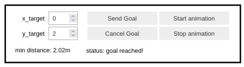
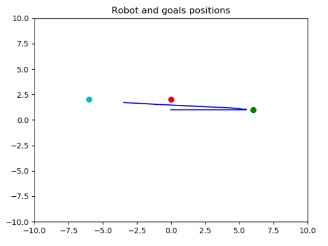
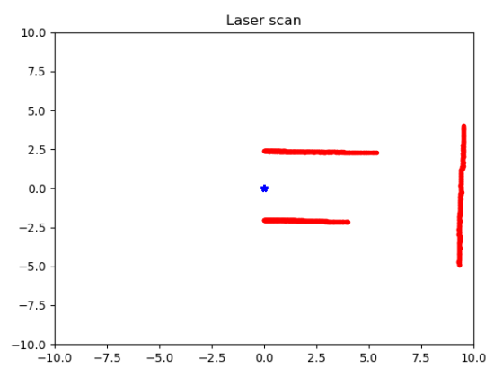
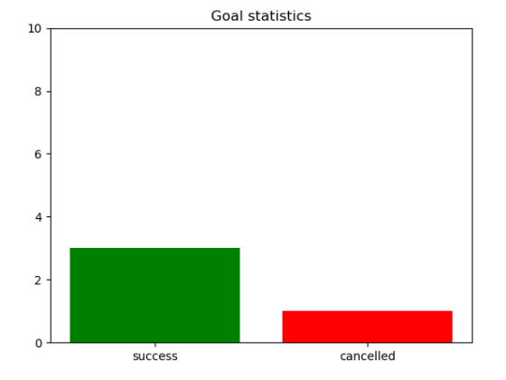

Jupyter notebook assignment
===========================
Aim of this assignment is the development in a [jupyter notebook](https://jupyter.org/) of an interface to control the movement of a robot in a given environment.  
The assignment is based on the ROS package [assignemnt_2_2022](https://github.com/CarmineD8/assignment_2_2022) which implements, among other features, an action server to drive a robot with the [Bug 0 algorithm](https://www.cs.cmu.edu/~motionplanning/lecture/Chap2-Bug-Alg_howie.pdf) through a predefined environment. For convenience, such a package is included in this repository.  
The requirements of the assignments are the followings:  

- implements some buttons for handling the motion of the robot in the provided environment  
- a plot with the robot’s position and targets’ positions in the environment  
- a text box with the distance of the closest obstacle (or the overall plot of the laser scanner)  
- A plot for the number of reached/not-reached targets  

All the requirements have been fulfilled with the jupyter notebook [nodeA.ipynb](https://github.com/davideCaligola/rt2_assignment2/blob/main/rt2_ass2/nodeA.ipynb).

Installation
------------

Requirements:  

- ROS environment is already installed and working properly,
- Git version control system properly installed,
- a proper Github SSH key setup (see [Adding a new SSH key to your GitHub account](https://docs.github.com/en/authentication/connecting-to-github-with-ssh/adding-a-new-ssh-key-to-your-github-account) for more information about it)  
- jupyter notebook properly installed


The software has been tested in a machine with Linux Ubuntu 20.04 LTS.  
To use the packages in this repository, create a directory where a catkin workspace will be created for running the packages:

```bash
mkdir test_ws
```

Clone the repository in the test_ws/src folder:

```bash
git clone git@github.com:davideCaligola/rt2_assignment2.git test_ws/src
```

Navigate into the workspace folder and build the packages

```bash
cd test_ws
catkin_make
```

Setup the current workspace

```bash
source ./devel/setup.bash
```

Launch the simulation

```bash
roslaunch rt2_ass2 rt2_ass2.launch
```

Launch the jupyter notebook, with option `--allow-root` if needed.

```bash
jupyter notebook --allow-root
```
From the web interface select and open the jupyter notebook nodeA.ipynb, under the folder rt2_ass2.  
See section [Use](#use) for more information on how to interact with it.

Use
---
The jupyter notebook implements the following user interface:


</img>
<p>User interface</p>

- The two input text `x_target` and `y_target` allow to specify target the coordinates the robot moves to.  
- The button `Send Goal` sends the goal to the action server, which drives the robot toward the selected coordinates  
- the button `Cancel Goal` sends the request to cancel the current goal
- the buttons `Stop animation` and `Start animation` allow to stop the live update of the plots used to show in realtime the behaviour of the robot.  
- The label `min. distance` reports the minimal obstacle distance from the robot measured by the laser scan
- The label `status` reports the current robot status.  

The behaviour of the robot is described by the position plot, which reports the trajectory the robot has accomplished and is doing to reach the specified target, the current goal in cyan, the successfully reached goals in green and the cancelled goals in read. An example of such a plot is reported in the following figure:


<p>Robot goal and position plot</p>

The laser scan information is reported in the related plot, providing information of the obstacles surrounding the robot. An example of a laser scan plot is reported in the following figure:


<p>Laser scan plot</p>

The number of the successfully reached or cancelled goals is reported in a bar chart, as shown in the following figure:


<p>Goal statistics</p>

Improvements
------------
The jupyter notebook can be improved in several ways, among the others:  
- Error handling  
  Currently there is not any error handling. It is possible to improve it considering a deeper analysis and a more careful implementation.
- User Interface  
  enable/disable the user interface buttons according to the robot status  
- Laser scan plot  
  Currently, the laser scan plot keeps the reference frame on the robot and moves the data coming from the laser scan. It would be possible to compensate the reported data from the laser scan with the robot odometry, keeping the environment fixed frame as reference, instead of the robot itself.
- Robot goal position and laser scan  
  Implementing the previous improvement on the laser scan plot, it would be possible to merge the robot goal position plot with the laser scan plot, having a realtime update of the robot status and the obstacles surrounding the robot  
- Quit  
  Currently to exit the simulation environment, `CTRL+C` must be pressed. A better and more gracefully shutdown from the user interface should be implemented.
